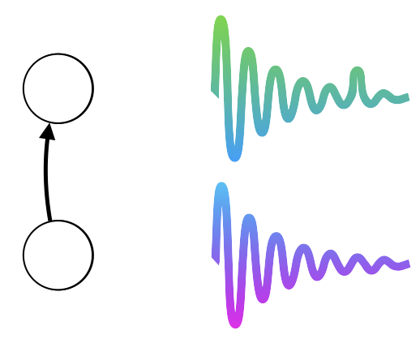

<p align="center">
    
</p>
<p align="center"><h1 align="center">HAG</h1></p>
<p align="center">
	<em>Experiments on bio inspired plasticity to improve reservoir computing</em>
</p>
<p align="center">
	
	
	
	
</p>
<p align="center"><!-- default option, no dependency badges. -->
</p>
<p align="center">
	<!-- default option, no dependency badges. -->
</p>
<br>

## 🔗 Table of Contents

- [📍 Overview](#-overview)
- [👾 Features](#-features)
- [📁 Project Structure](#-project-structure)
  - [📂 Project Index](#-project-index)
- [🚀 Setup](#-getting-started)
  - [☑️ Prerequisites](#-prerequisites)
  - [⚙️ Installation](#-installation)

- [🎗 License](#-license)
- [🙌 Acknowledgments](#-acknowledgments)

---

## 📍 Overview

The hadsp project addresses the challenge of adapted time-series data processing for reservoir computing.

---

## 👾 Features

|      | Feature         | Summary                                                                                                                                                                                                                                                                                                                                       |
| :--- | :---:           |:----------------------------------------------------------------------------------------------------------------------------------------------------------------------------------------------------------------------------------------------------------------------------------------------------------------------------------------------|
| ⚙️  | **Architecture**  | <ul><li>Utilizes a reservoir computing framework with modules for dynamic reservoir and input matrix initialization.</li><li>Incorporates excitatory-inhibitory models for efficient handling of dynamic systems and time-series data.</li><li>Supports both prediction and classification tasks with specialized modules for each.</li></ul> |
| 🧩 | **Modularity**    | <ul><li>Distinct modules for data loading, preprocessing, and model evaluation.</li><li>Flexible architecture allowing easy addition of new datasets and models.</li><li>Utility modules for mathematical operations and neural network analysis.</li></ul>                                                                                   |
| ⚡️  | **Performance**   | <ul><li>Optimized for large-scale computations with vectorized operations in activation functions.</li><li>Parallel processing capabilities for efficient data handling and model training.</li><li>Performance metrics include MSE, NMSE, and NRMSE for model accuracy assessment.</li></ul>                                                 |
| 📦 | **Dependencies**  | <ul><li>Managed via `<conda>` with an `environment.yml` file for reproducibility.</li><li>We use `<ReservoirPy>`.</li></ul>                                                                                                                                                                                                                   |

---

## 📁 Project Structure

```sh
└── hadsp/
    ├── 1.general_framework.ipynb
    ├── 2.hyperparameter optimisation.ipynb
    ├── 3.test performances.ipynb
    ├── README.md
    ├── SpeechCommand.py
    ├── analysis
    │   ├── capacities.py
    │   ├── richness.py
    │   └── topology.py
    ├── connexion_generation
    │   ├── correlation_utility.py
    │   ├── hag.py
    │   └── utility.py
    ├── datasets
    │   ├── load_classification.py
    │   ├── load_prediction.py
    │   ├── multivariate_generation.py
    │   └── preprocessing.py
    ├── environment.yml
    ├── outputs
    │   ├── test_results_classification.csv
    │   └── test_results_prediction.csv
    ├── performances
    │   ├── __pycache__
    │   ├── esn_model_evaluation.py
    │   ├── losses.py
    │   └── utility.py
    ├── plots
    │   ├── connectivity.py
    │   ├── network.py
    │   └── plots.py
    └── reservoir
        ├── activation_functions.py
        ├── reservoir.py
        └── reservoir_ei.py
```


### 📂 Project Index
<details open>
	<summary><b><code>HADSP/</code></b></summary>
	<details> <!-- __root__ Submodule -->
		<summary><b>__root__</b></summary>
		<blockquote>
			<table>
			<tr>
				<td><b><a href='https://github.com/Finebouche/hadsp/blob/master/environment.yml'>environment.yml</a></b></td>
				<td>- The environment.yml file establishes the project's development environment by specifying necessary dependencies and channels<br>- It ensures consistency across different setups by listing essential libraries and tools for data analysis, machine learning, and audio processing, such as PyTorch, TensorFlow, and librosa<br>- This setup facilitates seamless collaboration and reproducibility, supporting the project's goals of advanced data processing and experimentation within a JupyterLab environment.</td>
			</tr>
			<tr>
				<td><b><a href='https://github.com/Finebouche/hadsp/blob/master/SpeechCommand.py'>SpeechCommand.py</a></b></td>
				<td>- The `SpeechCommand.py` file is a component of the project that focuses on handling and processing audio datasets, specifically the SPEECHCOMMANDS dataset<br>- Its primary purpose is to load, concatenate, and preprocess audio data for further analysis or model training<br>- By leveraging libraries such as torchaudio and sklearn, it efficiently manages dataset splitting and encoding, preparing the data for machine learning tasks<br>- This file plays a crucial role in the data preparation phase of the project, ensuring that audio samples are correctly formatted and ready for subsequent processing or model development within the broader codebase architecture.</td>
			</tr>
			<tr>
				<td><b><a href='https://github.com/Finebouche/hadsp/blob/master/1.general_framework.ipynb'>1.general_framework.ipynb</a></b></td>
				<td>- The file `1.general_framework.ipynb` serves as an introductory component within the project's architecture, primarily setting up the foundational environment for data processing and visualization tasks<br>- It imports essential libraries and tools that facilitate parallel processing, data manipulation, and graphical representation<br>- This setup is crucial for ensuring that subsequent modules in the codebase can efficiently perform complex computations and present data insights effectively<br>- The file acts as a preparatory stage, establishing the necessary groundwork for more specialized functionalities in the project.</td>
			</tr>
			<tr>
				<td><b><a href='https://github.com/Finebouche/hadsp/blob/master/3.test performances.ipynb'>3.test performances.ipynb</a></b></td>
				<td>- The file "3.test performances.ipynb" is a Jupyter Notebook within the project that focuses on evaluating and visualizing the performance of different activation functions used in the reservoir computing framework<br>- It serves as a testing ground to assess how various activation functions, such as `tanh` and `heaviside`, impact the overall performance of the system<br>- By leveraging libraries like NumPy, joblib, and matplotlib, the notebook facilitates parallel processing and graphical representation of results, contributing to the project's goal of optimizing neural network components for enhanced computational efficiency and accuracy.</td>
			</tr>
			<tr>
				<td><b><a href='https://github.com/Finebouche/hadsp/blob/master/2.hyperparameter optimisation.ipynb'>2.hyperparameter optimisation.ipynb</a></b></td>
				<td>- The file "2.hyperparameter optimisation.ipynb" is a Jupyter Notebook dedicated to the process of hyperparameter optimization within the project's architecture<br>- Its primary purpose is to enhance the performance of machine learning models by systematically tuning their hyperparameters<br>- This file likely plays a crucial role in the project's workflow by ensuring that models are fine-tuned for optimal accuracy and efficiency, contributing to the overall robustness and effectiveness of the system<br>- The notebook also includes sections for dataset loading, indicating its integration with data preprocessing and model training phases.</td>
			</tr>
			</table>
		</blockquote>
	</details>
	<details> <!-- performances Submodule -->
		<summary><b>performances</b></summary>
		<blockquote>
			<table>
			<tr>
				<td><b><a href='https://github.com/Finebouche/hadsp/blob/master/performances/utility.py'>utility.py</a></b></td>
				<td>- Facilitates model selection and naming conventions within the project by providing utility functions<br>- Converts camel case strings to snake case for consistent naming and retrieves the best model from an Optuna study based on specified parameters<br>- Ensures input validation for function names, variate types, and data types, contributing to the project's robustness in handling performance evaluations and optimizations.</td>
			</tr>
			<tr>
				<td><b><a href='https://github.com/Finebouche/hadsp/blob/master/performances/esn_model_evaluation.py'>esn_model_evaluation.py</a></b></td>
				<td>- Facilitates the evaluation of Echo State Network (ESN) models within the project by providing functions to initialize various reservoir models, train them for prediction or classification tasks, and compute performance scores<br>- Supports different training modes and readout mechanisms, enhancing the flexibility and adaptability of ESN models for diverse machine learning applications in the codebase.</td>
			</tr>
			<tr>
				<td><b><a href='https://github.com/Finebouche/hadsp/blob/master/performances/losses.py'>losses.py</a></b></td>
				<td>- The `performances/losses.py` module provides functions to calculate error metrics, specifically mean square error (MSE), normalized mean square error (NMSE), and normalized root mean square error (NRMSE), for evaluating the accuracy of input signals against target signals<br>- These metrics are crucial for assessing model performance within the broader codebase, particularly in tasks involving signal processing or prediction accuracy.</td>
			</tr>
			</table>
		</blockquote>
	</details>
	<details> <!-- analysis Submodule -->
		<summary><b>analysis</b></summary>
		<blockquote>
			<table>
			<tr>
				<td><b><a href='https://github.com/Finebouche/hadsp/blob/master/analysis/capacities.py'>capacities.py</a></b></td>
				<td>- The file `analysis/capacities.py` is part of a larger project and primarily focuses on mathematical and statistical operations related to data analysis<br>- It leverages the SciPy library to perform various computations, such as polynomial evaluations, mean extraction from datasets, and calculations involving Legendre polynomials<br>- These functions are likely used to process and analyze data within the project's broader context, possibly in the domain of signal processing or statistical analysis<br>- The file serves as a utility module that provides essential mathematical tools to support the project's analytical capabilities.</td>
			</tr>
			<tr>
				<td><b><a href='https://github.com/Finebouche/hadsp/blob/master/analysis/richness.py'>richness.py</a></b></td>
				<td>- The analysis/richness.py module enhances the project's analytical capabilities by providing functions to assess the dynamic properties of neural state histories<br>- It calculates metrics such as spectral radius, Pearson correlation, and condition numbers, and employs techniques like PCA and SVD to evaluate the evolution of neural dynamics over time<br>- This aids in understanding the complexity and variability of neural networks within the codebase.</td>
			</tr>
			<tr>
				<td><b><a href='https://github.com/Finebouche/hadsp/blob/master/analysis/topology.py'>topology.py</a></b></td>
				<td>- The `analysis/topology.py` module analyzes network motifs within a given connectivity matrix, identifying and quantifying specific subgraph patterns<br>- It calculates the distribution of these motifs, which are essential for understanding the structural properties of complex networks<br>- Additionally, it visualizes the motif distribution through graphical representations, aiding in the interpretation of network topology and facilitating insights into the network's organizational principles.</td>
			</tr>
			</table>
		</blockquote>
	</details>
	<details> <!-- reservoir Submodule -->
		<summary><b>reservoir</b></summary>
		<blockquote>
			<table>
			<tr>
				<td><b><a href='https://github.com/Finebouche/hadsp/blob/master/reservoir/activation_functions.py'>activation_functions.py</a></b></td>
				<td>- Defines a set of activation functions used for transforming input data in neural network models<br>- These functions, including softmax, sigmoid, tanh, and relu, are essential for introducing non-linearity into the models, enabling them to learn complex patterns<br>- The file also includes a utility to vectorize functions, ensuring efficient application of these transformations on arrays, which is crucial for performance in large-scale computations.</td>
			</tr>
			<tr>
				<td><b><a href='https://github.com/Finebouche/hadsp/blob/master/reservoir/reservoir_ei.py'>reservoir_ei.py</a></b></td>
				<td>- The `reservoir_ei.py` module facilitates the training and execution of an excitatory-inhibitory reservoir computing model<br>- It manages state updates, applies ridge regression for output weight computation, and processes input sequences to generate predictions<br>- This functionality is integral to the project's architecture, enabling efficient handling of dynamic systems and time-series data through reservoir computing techniques.</td>
			</tr>
			<tr>
				<td><b><a href='https://github.com/Finebouche/hadsp/blob/master/reservoir/reservoir.py'>reservoir.py</a></b></td>
				<td>- Reservoir computing framework is supported by initializing and updating matrices that simulate a dynamic reservoir<br>- It facilitates the creation of sparse reservoir and input matrices with specified connectivity and distributions, ensuring reproducibility through seeding<br>- The framework is designed to process inputs through a leaky integration mechanism, applying an activation function to model complex temporal patterns, enhancing the project's capability for time-series prediction and analysis.</td>
			</tr>
			</table>
		</blockquote>
	</details>
	<details> <!-- datasets Submodule -->
		<summary><b>datasets</b></summary>
		<blockquote>
			<table>
			<tr>
				<td><b><a href='https://github.com/Finebouche/hadsp/blob/master/datasets/load_prediction.py'>load_prediction.py</a></b></td>
				<td>- The `datasets/load_prediction.py` module facilitates the preparation and visualization of time series datasets for forecasting tasks within the project<br>- It provides functions to load and preprocess the Mackey-Glass, Lorenz, and Sunspot datasets, offering both training and testing data splits<br>- Additionally, it supports data visualization to aid in understanding the datasets' temporal patterns, enhancing the project's predictive modeling capabilities.</td>
			</tr>
			<tr>
				<td><b><a href='https://github.com/Finebouche/hadsp/blob/master/datasets/load_classification.py'>load_classification.py</a></b></td>
				<td>- Facilitates the loading and preprocessing of various audio and time-series datasets for classification tasks within the project<br>- It supports multiple datasets, including SPEECHCOMMANDS, FSDD, HAART, and others, by providing functions to download, process, and split data into training and testing sets<br>- Additionally, it handles label encoding and one-hot encoding, ensuring data is ready for model training and evaluation.</td>
			</tr>
			<tr>
				<td><b><a href='https://github.com/Finebouche/hadsp/blob/master/datasets/preprocessing.py'>preprocessing.py</a></b></td>
				<td>- The `datasets/preprocessing.py` module enhances data preparation within the project by providing functions for flexible data indexing, scaling, noise addition, data duplication, and class distribution visualization<br>- These utilities support efficient preprocessing of datasets, crucial for training and evaluating machine learning models, ensuring data consistency and aiding in the analysis of class distributions across training, validation, and test datasets.</td>
			</tr>
			<tr>
				<td><b><a href='https://github.com/Finebouche/hadsp/blob/master/datasets/multivariate_generation.py'>multivariate_generation.py</a></b></td>
				<td>- The `datasets/multivariate_generation.py` module focuses on generating multivariate datasets by extracting peak frequencies from input signals and applying bandpass filters<br>- It supports both spectral representation and frequency filtering to transform signals, facilitating tasks like classification<br>- Visualization capabilities are included to aid in understanding the frequency components and effects of filtering, enhancing the overall data processing workflow within the project.</td>
			</tr>
			</table>
		</blockquote>
	</details>
	<details> <!-- connexion_generation Submodule -->
		<summary><b>connexion_generation</b></summary>
		<blockquote>
			<table>
			<tr>
				<td><b><a href='https://github.com/Finebouche/hadsp/blob/master/connexion_generation/correlation_utility.py'>correlation_utility.py</a></b></td>
				<td>- Facilitates the computation of mutual information and Pearson correlation between neuron states to assess their relationships and dependencies<br>- It supports both custom and Scikit-learn methods for calculating mutual information, allowing for performance comparisons<br>- This utility is integral to analyzing neural data, providing insights into the correlation and information exchange between different neuron groups within the broader project architecture.</td>
			</tr>
			<tr>
				<td><b><a href='https://github.com/Finebouche/hadsp/blob/master/connexion_generation/hag.py'>hag.py</a></b></td>
				<td>- Facilitates the dynamic adjustment of synaptic connections within a neural network model by implementing algorithms for synaptic change based on variance and rate<br>- It supports homeostatic plasticity through pruning and adding connections, optimizing network performance<br>- The module integrates with other components to update reservoir states and visualize connection changes, contributing to the overall adaptability and efficiency of the system.</td>
			</tr>
			<tr>
				<td><b><a href='https://github.com/Finebouche/hadsp/blob/master/connexion_generation/utility.py'>utility.py</a></b></td>
				<td>- Facilitates the dynamic management of neural connections within a network by determining which neurons should form new connections or be pruned<br>- Utilizes methods such as mutual information, Pearson correlation, or random selection to guide these decisions<br>- Supports parallel processing to enhance performance, ensuring efficient updates to the connectivity matrix based on specified criteria and constraints.</td>
			</tr>
			</table>
		</blockquote>
	</details>
	<details> <!-- plots Submodule -->
		<summary><b>plots</b></summary>
		<blockquote>
			<table>
			<tr>
				<td><b><a href='https://github.com/Finebouche/hadsp/blob/master/plots/connectivity.py'>connectivity.py</a></b></td>
				<td>- Visualizations of neural network connectivity and weight matrices are facilitated by the code, enhancing interpretability of model parameters<br>- It provides functions to plot readout weights, display matrices using heatmaps, and visualize excitatory-inhibitory connections<br>- These visual tools aid in understanding the structure and dynamics of neural networks within the project, supporting analysis and debugging of model behavior.</td>
			</tr>
			<tr>
				<td><b><a href='https://github.com/Finebouche/hadsp/blob/master/plots/plots.py'>plots.py</a></b></td>
				<td>- Visualizes the performance of predictive models by plotting predicted versus true values and highlighting deviations<br>- Enhances understanding of model accuracy and performance over a specified range<br>- Integral to the project's analytical capabilities, it aids in assessing the effectiveness of prediction algorithms, providing a clear graphical representation that supports data-driven decision-making and model refinement within the broader codebase architecture.</td>
			</tr>
			<tr>
				<td><b><a href='https://github.com/Finebouche/hadsp/blob/master/plots/network.py'>network.py</a></b></td>
				<td>- The `plots/network.py` module facilitates the visualization and animation of network graphs within the project<br>- It constructs directed graphs from connection matrices, assigns visual properties to edges and vertices, and generates static or animated visual representations<br>- This functionality aids in understanding complex network structures and dynamics by providing clear, visual insights into the relationships and interactions within the data.</td>
			</tr>
			</table>
		</blockquote>
	</details>
</details>

---
## 🚀 Setup

### ☑️ Prerequisites

Before getting started with hadsp, ensure your runtime environment meets the following requirements:

- **Programming Language:** Python
- **Package Manager:** Conda


### ⚙️ Installation

Install hadsp using one of the following methods:

**Build from source:**

1. Clone the hadsp repository:
```sh
❯ git clone https://github.com/Finebouche/hadsp
```

2. Navigate to the project directory:
```sh
❯ cd hadsp
```

3. Install the project dependencies:


**Using `conda`** &nbsp; [](https://docs.conda.io/)

```sh
❯ conda env create -f environment.yml
```


## 🎗 License

This project is protected under the [SELECT-A-LICENSE](https://choosealicense.com/licenses) License. For more details, refer to the [LICENSE](https://choosealicense.com/licenses/) file.

---

## 🙌 Acknowledgments

- List any resources, contributors, inspiration, etc. here.

---
