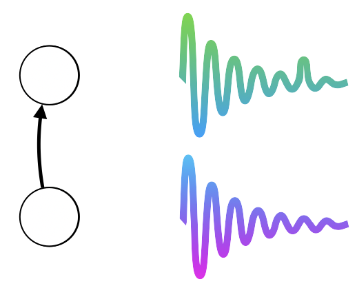

<p align="center">
    
</p>
<p align="center"><h1 align="center">HAG</h1></p>
<p align="center">
	<em>Experiments on bio inspired plasticity to improve reservoir computing</em>
</p>
<p align="center">
	
	
	
	
</p>
<p align="center"><!-- default option, no dependency badges. -->
</p>
<p align="center">
	<!-- default option, no dependency badges. -->
</p>
<br>

## 🔗 Table of Contents

- [📍 Overview](#-overview)
- [📚 Publications](#-publications)
- [🗂 Repository structure](#-repository-structure)
- [🚀 Setup](#-getting-started)
  - [☑️ Prerequisites](#-prerequisites)
  - [⚙️ Installation](#-installation)

- [🎗 License](#-license)

---

## 📍 Overview

HAG introduces an innovative, biologically-inspired approach to improve Reservoir Computing networks. Grounded in Hebbian plasticity principles, HAG dynamically constructs and optimizes reservoir architectures to enhance the adaptability and efficiency of time-series prediction and classification tasks. By autonomously forming and pruning connections between neurons based on Pearson correlation, HAG tailors reservoirs to the specific demands of each task, aligning with biological neural network principles and Cover’s theorem.

---
## 📚 Publications

### **2025**

- **[Reshaping reservoirs with unsupervised Hebbian adaptation](https://doi.org/10.1038/s41467-025-67137-1)**  
  *Tanguy Cazalets, Joni Dambre*  
  *Nature Communications*  
  This paper introduces HAG.

### **2023**

- **[A Bio-Inspired Model for Audio Processing](https://doi.org/10.1109/ijcnn54540.2023.10191230)**  
  *Tanguy Cazalets, Joni Dambre*  
  *Presented at RIVF 2023*  
  This paper introduces a biologically-inspired approach to audio processing, emphasizing homeostatic mechanisms and plasticity for efficient neural network performance.

- **[A Homeostatic Activity-Dependent Structural Plasticity Algorithm for Richer Input Combination](https://doi.org/10.1109/rivf60135.2023.10471845)**  
  *Tanguy Cazalets, Joni Dambre*  
  *Presented at IJCNN 2023*  
  This work explores an innovative algorithm for structural plasticity, enhancing neural network adaptability to diverse input combinations.

---
## 🗂 Repository structure

| Folder | Content |
|:--|:--|
| `hag/hag` | The HAG algorithm (`run_algorithm`): structural plasticity driven by the mean (mean HAG) or variance (variance HAG) of the neurons' activity, partners chosen by Pearson correlation |
| `hag/models` | Reservoirs: HAG as a reservoirpy node (`HAGReservoir`), intrinsic and local plasticity reservoirs (NumPy and JAX), matrix initialization, RNN baselines |
| `hag/datasets` | Dataset loaders (classification, forecasting, Canary) and preprocessing (`prepare_data`: MFCC / spectrogram, scaling) |
| `hag/hpo` | Hyperparameter optimization with Optuna (`hpo_esn.py`, `hpo_rnn.py`); studies in `hpo/legacy_studies` |
| `hag/performances` | Test evaluation of the reservoirs (`evaluation_esn.py`) and RNNs (`evaluation_rnn.py`), batched JAX runs, figure style |
| `hag/metrics` | Reservoir metrics: spectral radius, correlations, explained variance, separability, capacities |
| `hag/analysis` | Analysis scripts, results in `outputs/analysis_results` |
| `hag/rl` | Reinforcement learning with HAG as preprocessing: partially observable benchmarks (classic control, MuJoCo "-P", POPGym), causal filter bank, reservoir features and PPO (`python -m hag.rl.train`), hyperparameter optimization (`python -m hag.rl.hpo`), results in `outputs/rl_results` |
| `slurm` | Jobs of the RL experiments on PlaFRIM: environment (`setup_env.sh`), one job per benchmark (`submit_rl.sh`, `rl.sbatch`) |
| `*.ipynb` | Notebooks: HAG framework, test results and figures, HAG dynamics, exploration |

---
## 🚀 Setup

### ☑️ Prerequisites

Before getting started with HAG, ensure your runtime environment meets the following requirements:

- <code>reservoirPy</code> for reservoir computing training and inference
- <code>optuna</code> for hyperparameter optimization
- <code>librosa</code> for time-series preprocessing

### ⚙️ Installation

Install HAG using one of the following methods:

**Build from source:**

1. Clone the HAG repository:
```sh
❯ git clone https://github.com/Finebouche/HAG
```

2. Navigate to the project directory:
```sh
❯ cd HAG
```

3. Install the project dependencies:


**Using `conda`** &nbsp; [](https://docs.conda.io/)

```sh
❯ conda env create -f environment.yml
❯ conda activate hag_env
❯ pip install -e .
```

**Using `pip`**

```sh
❯ python -m pip install -e .
```

Notebook dependencies can be installed with:

```sh
❯ python -m pip install -e ".[notebooks]"
```


## 🎗 License

This project is protected under the [MIT License ](https://choosealicense.com/licenses/mit/) License.

---

## 🙌 Acknowledgments

- This project has received funding from the European Union’s Horizon 2020 research and innovation programme under the Marie Skłodowska-Curie grant agreement No 860949

---
